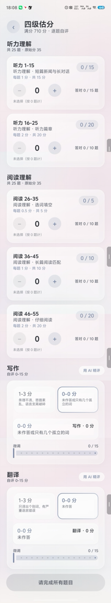
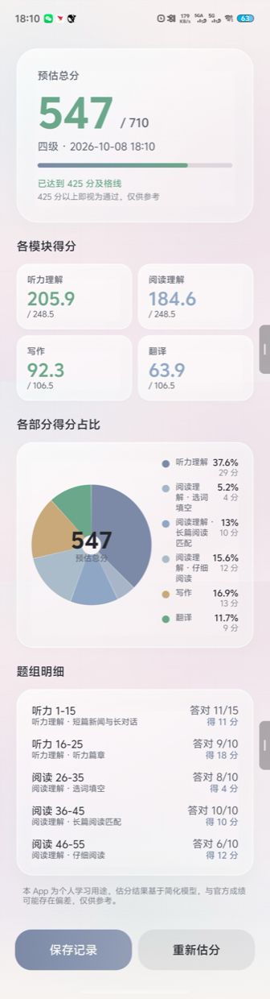
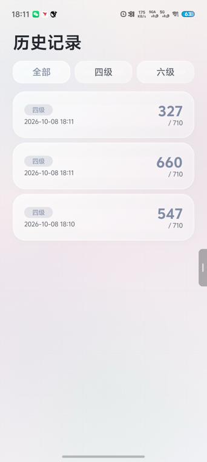
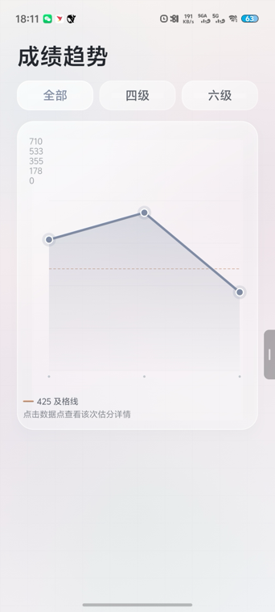
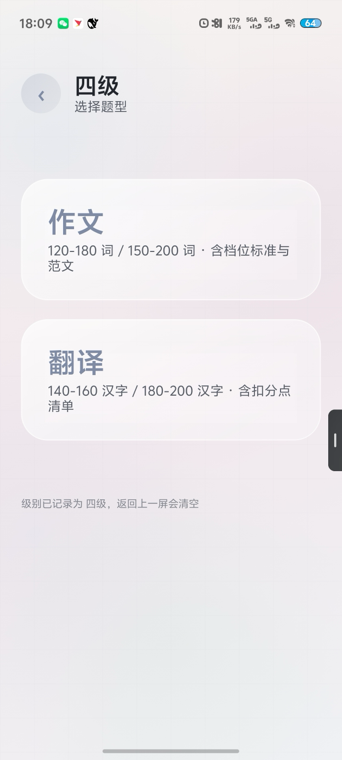
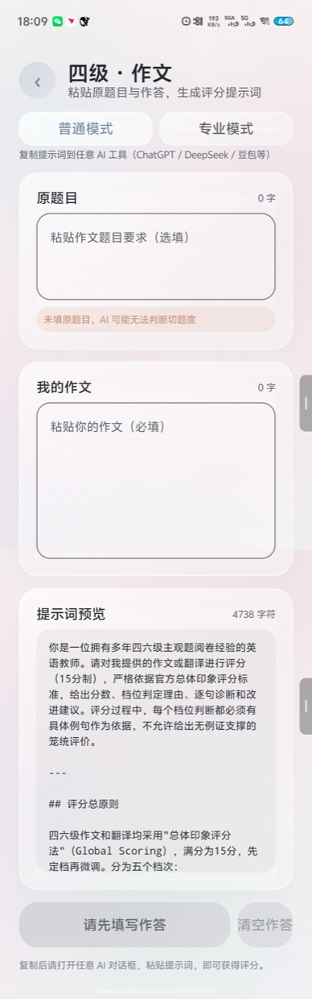
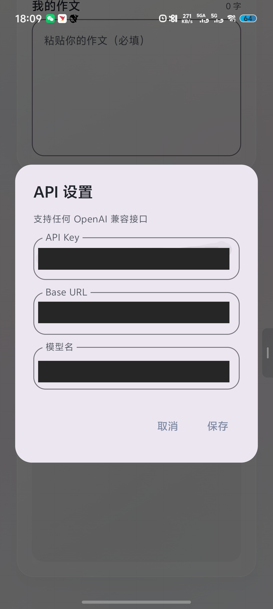
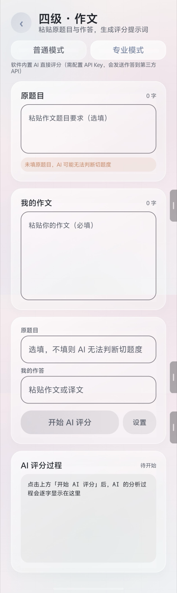

# CET_Score · 完整功能介绍

> 一个**单个安装包**的 Android App：本地逐题估分 + 历史趋势 + AI 评分助手。
> 除 AI 专业模式外，全部功能离线运行，数据只存在手机上。

---

## 一、这个 App 做什么

一句话：**输入你四六级考试的真实对错情况，算出 710 分制的预估总分。**

它解决的是考完试之后最想知道的一件事 —— 我能考多少分。

传统做法是对着答案自己心算：听力错 3 道扣多少？阅读错 8 道扣多少？
写作作文自己估是几分？加一加乘 7.1。这个 App 把这套换算做成了一套可重复、可追溯的流程，
并且把每次估分存下来，看得见进步。

### 三个核心场景

| 场景 | 用什么 |
|---|---|
| 考完试想知道大概分 | 首页 → 四级/六级估分 → 逐题输入 → 看总分 |
| 想看自己有没有进步 | 首页 → 趋势，查看历次分数折线 |
| 作文/翻译拿不准分 | 首页 → AI 评分助手，把作文交给 AI 按官方标准评 |

---

## 二、功能总览

```
首页
├── 四级估分 ─────────→ 估分输入页 ──→ 结果页 ──┬─→ 保存到历史
├── 六级估分 ─────────→ （同上）                └─→ 重新估分
├── AI 评分助手 ────→ 级别选择 → 题型选择 → 评分界面
├── 历史记录 ─────────→ 列表 / 筛选 / 详情 / 备注
└── 趋势 ────────────→ 折线图 / 及格线 / 详情
```

共 6 个页面、10 个 Gradle 模块（app + 9 个业务模块）。

---

## 三、逐个功能讲清楚

### 1. 首页


四个入口卡片：

- **四级估分** —— 710 分制 · 逐题自评
- **六级估分** —— 710 分制 · 逐题自评
- **AI 评分助手** —— 复制提示词，用 AI 精评作文
- **历史记录 / 趋势** —— 并排两个小卡片

底部有免责声明：**本 App 为个人学习用途，估分结果基于简化模型，与官方成绩可能存在偏差，仅供参考。**

---

### 2. 估分输入页




自上而下五个区块：

#### 顶部
考试类型标题 + 返回按钮。

#### 听力区（2 个题组）

| 题组 | 题号 | 每题 | 小计 |
|---|---|---|---|
| 听力 1-15 | 1-15 | 1 分 | 15 |
| 听力 16-25 | 16-25 | 2 分 | 20 |

- 四级全称：「听力理解 · 短篇新闻与长对话」/「听力理解 · 听力篇章」
- 六级全称：「听力理解 · 长对话与听力篇章」/「听力理解 · 讲座/讲话」

#### 阅读区（3 个题组，四六级相同）

| 题组 | 题号 | 每题 | 小计 |
|---|---|---|---|
| 阅读 26-35 · 选词填空 | 26-35 | 0.5 分 | 5 |
| 阅读 36-45 · 长篇阅读匹配 | 36-45 | 1 分 | 10 |
| 阅读 46-55 · 仔细阅读 | 46-55 | 2 分 | 20 |

#### 写作区 / 翻译区

「档位 + 微调」两级输入：

1. **先点档位卡片**（6 档，横滑），默认取该档区间中位数
2. **再用滑块在档位内微调**

写作档位（以四级为例，六级标准更严格、文案略有调整）：

| 档位 | 分数 | 标准 |
|---|---|---|
| 14 分档 | 13-15 | 切题，思想表达清楚，文字通顺连贯，结构清晰，基本无语言错误 |
| 11 分档 | 10-12 | 切题，表达思想清楚，文字连贯，有少量语言错误但不影响理解 |
| 8 分档 | 7-9 | 基本切题，部分地方表达不够清楚，文字勉强连贯，语言错误较多 |
| 5 分档 | 4-6 | 基本切题，但表达思想不清楚，连贯性差，有较多严重语言错误 |
| 2 分档 | 1-3 | 条理不清，思路紊乱，语言支离破碎 |
| 0 分 | 0 | 未作答或只有几个孤立的词 |

翻译档位同样是 6 档，标准围绕「信 / 达 / 雅」三个维度。

#### 数字步进器

`−  数字  +` 三件套，输入答对题数。

- **单击**：点一下加 1 / 减 1
- **长按**（≥1 秒）：进入快速模式，每 100ms 自动加/减 1，按钮放大给视觉反馈
- **松手 / 手指移出 / 触摸取消**：立即停止
- **下限 0**，不可为负
- 长按时触觉反馈（震动）

> 这里曾经有个严重 bug：点一下就疯狂自己加/减停不下来。根因是 Compose 里
> `pointerInput` 的 key 包含了 `value`，按下改值会让协程被重启、清理逻辑永不执行，
> 留下一条孤儿协程每 100ms 加一次。修复方式是让连发逻辑由状态机在指针事件循环内驱动，
> **不 spawn 任何长生命周期协程**。详见 `NumberStepper.kt` 注释。

#### 底部固定按钮

**「计算预估分」** —— 大圆角、主色填充、悬浮阴影。
作答不完整时置灰不可点。

---

### 3. 结果页




#### 顶部大卡片

- **预估总分**（超大数字，如 523）
- 副标题：「四级 · 2025-06-14 15:30」
- 细进度条，按 710 满分比例填充
- 及格提示：「已达到 425 分及格线」/「距 425 分及格线还差 XX 分」
- 「425 分以上即视为通过，仅供参考」

#### 模块得分（2×2 网格）

| 模块 | 满分 |
|---|---|
| 听力理解 | 248.5 |
| 阅读理解 | 248.5 |
| 写作 | 106.5 |
| 翻译 | 106.5 |

#### 各部分得分占比（环形图）

**6 个部分**：

| 部分 | 来源 |
|---|---|
| 听力理解 | 两个题组合并为一项 |
| 阅读理解 · 选词填空 | 题组 26-35 |
| 阅读理解 · 长篇阅读匹配 | 题组 36-45 |
| 阅读理解 · 仔细阅读 | 题组 46-55 |
| 写作 | 自评 0-15 |
| 翻译 | 自评 0-15 |

- 环形图用 Compose Canvas 手绘，**不引入图表库**
- 中心显示总分
- 图例用全称，每个色块后跟「xx.x%」
- 占比为 0 的部分不参与扇形绘制（避免起止角相同画出异常细线）
- **6 项占比精确等于 100.0%**

> **怎么保证恰好 100%？**
> 六等分时每项是 16.666…%，各自四舍五入会得到 100.2%，环形图出现明显缺口。
> 解法是**最大余数法 + 分配精度与展示精度对齐**：以 0.1%（1000 单位 = 100%）
> 为最小单位分配，各项先向下取整、剩余单位按小数部分从大到小补给各项。
> 这样总和精确等于 100.0，无需最后再四舍五入。

#### 明细列表

每行：「听力 1-15 · 答对 12/15 · 得 12 分」

#### 底部按钮

- **保存记录** —— 存入历史，同时弹出备注输入框
- **重新估分** —— 返回输入页

---

### 4. 历史记录页




- 列表按**时间倒序**
- 每张卡片：
  - 左侧：考试类型标签（四级/六级用不同颜色区分）
  - 中间：总分（大号）
  - 下方：日期时间
  - 备注：**只显示 1 行**，超出显示省略号
- 顶部 **全部 / 四级 / 六级** 分段切换
- **长按卡片**弹出菜单：编辑备注 / 删除
- **点击卡片**打开详情底部面板：完整备注（可滚动）、各模块分数、编辑/删除入口
- 空状态：插画 + 「还没有估分记录，去估一次吧」

---

### 5. 趋势页




- 顶部同样有 **全部 / 四级 / 六级** 切换
- 折线图用 Compose Canvas 手绘：
  - **X 轴**：时间；超过 7 个点时**抽稀**标签，避免文字重叠
  - **Y 轴**：0-710，标注 **425 及格线**（虚线）
  - 数据点：圆点，**点击弹出详情面板**
  - 折线带渐变填充

#### 长备注防撑爆图表（重点）

备注可能有几百字，直接渲染在图表上会挤爆布局。五层隔离：

1. **坐标系内绝不渲染备注文字** —— 只画数据点
2. 有备注的点旁只加一个 **6dp 极小圆环标记**，不占额外空间
3. **X 轴标签抽稀** —— 超过 6 个点只显示部分
4. **点击数据点**才弹 `RecordDetailBottomSheet`，完整备注在图表**外部**渲染、内部滚动
5. **图表高度固定**，备注再长也不改变图表尺寸

---

### 6. AI 评分助手

**一个 App，两种模式，用户在助手内顶部切换。**

#### 替换式导航（三屏，不是层层叠加）

```
第一屏：  四级 | 六级
            ↓ 点四级
第二屏：  作文 | 翻译        ← 四级/六级按钮从这里消失
            ↓ 点作文
第三屏：  四级-作文 评分界面
```

实现方式是 `when (step)` **每次只渲染当前屏** —— 上一屏的按钮根本不在 Composition 里。
这是最可靠的「替换」语义，不依赖 zIndex 或显隐动画。

**第一屏** —— 只有四级 / 六级两个按钮：


**第二屏** —— 四级/六级按钮已消失，换成作文 / 翻译：



**第三屏** —— 评分界面（含模式切换与两个输入框）：



**返回逻辑**：
- 第三屏 → 第二屏（**级别保留**，可改题型）
- 第二屏 → 第一屏（**清空级别与输入**）
- 第一屏 → 关闭页面

**两个入口的起始屏不同**：

| 入口 | 起始屏 | 原因 |
|---|---|---|
| 首页卡片 | 第一屏 | 让用户完整走一遍导航 |
| 估分页「用 AI 精评」 | 第三屏 | 已选定级别题型，省去重复选择 |

#### 原题目输入（2.3）

第三屏同时提供两个输入框：
- **原题目 / 翻译原文** —— 会一并拼进提示词，让 AI 能判断切题度
- **我的作文 / 我的译文**

原题目为空时允许提交，但会提示「未填原题目，AI 可能无法判断切题度」；
超过 2000 字自动截断并提示核对题干。

#### 提示词架构：公共部分 + 四套独立模块

```
common.md               角色设定 / 五档总原则 / 档内微调规则 / 降档红线 / 四六级差异
+ cet4-writing.md       120-180 词；四级容错基准（基础错误累计 3-5 处只档内扣分）；四级范文
+ cet4-translation.md   140-160 汉字；四级容错基准；四级扣分点
+ cet6-writing.md       150-200 词；六级严格基准（3 处错误即可能降档）；六级范文
+ cet6-translation.md   180-200 汉字；术语错译直接降档；机械直译每处扣 1-2 分
+ 【考试级别】【题型】【题目要求/翻译原文】【我的作答】
+ output-format.md      档位判定 / 维度分析 / 逐句诊断 / 升档关键 / 优化版本
```

拼接顺序**固定**，拼接规则是纯函数（可脱离 Android 单测）。

四套模块的差异不只是数字，判分松紧也完全不同：

| | 四级 | 六级 |
|---|---|---|
| 基础语法错误 | 累计 3-5 处通常只档内扣分 | **累计 3 处即可能降档** |
| 模板化语句 >30% | 扣分 | **得分限制在低档** |
| 翻译术语错译 | 档内扣分 | **直接判「重大语义偏差」，11 档 → 8 档** |
| 段落长度 | 140-160 汉字 | 180-200 汉字 |

#### 模式一：普通模式（默认）

界面只有：
- 原题目输入框
- 作答输入框
- **「生成提示词并复制」** 按钮

流程：填内容 → 系统按上述规则拼好完整提示词 → 一键复制 → 粘贴到
DeepSeek / 豆包 / ChatGPT 等任意 AI。

**不显示**：API Key 输入框、评分结果窗口、思考过程区。

复制后按钮短暂变为「已复制 ✓」，同时弹 Snackbar 提示，并给触觉反馈。

#### 模式二：专业模式

界面只有：
- 上方：**原题目** + **我的作答** + **「开始 AI 评分」** 按钮
- 下方：**AI 思考过程 / 流式输出窗口**

**隐藏**：复制提示词按钮、提示词预览、所有多余 UI。

需要先在设置里填 API Key、Base URL、模型名（支持任何 OpenAI 兼容接口，
默认 `https://api.deepseek.com/v1` + `deepseek-chat`）。



*专业模式的 API 设置弹窗，填写 API Key、Base URL 与模型名（图中信息已做脱敏处理）*




*专业模式界面：上方原题目与作答输入区 +「开始 AI 评分」，下方 AI 评分过程流式输出窗口*

评分体验：
- 分阶段提示：「正在准备评分上下文…」→「AI 正在阅读你的作答…」
- AI 输出**逐字显示**，窗口可滚动并**自动吸底**
- 完成后**高亮档位判定与最终分数**

异常处理：
- API Key 缺失 → 提示去设置页填写，**不静默失败**
- 流式中断 → **保留已输出内容**，提示是否重试
- 超时 → 上限 60s
- 结果解析失败 → **原文照常展示**，不强行格式化
- **首次使用明确告知**：「作答将发送至第三方 API」

> **关于联网**
> 普通模式全程**不发起任何网络请求**。只有当用户**主动切到专业模式并点击评分**时才会联网。
> Android 权限是「允许」而非「强制」—— 不发请求就不会联网。
> 除 `INTERNET` 外无任何权限，不申请存储/相机/位置，数据存应用私有目录。

---

## 四、估分算法

### 换算链路

```
听力答对原始分（35 满分）
+ 阅读答对原始分（35 满分）
+ 写作自评（0-15）
+ 翻译自评（0-15）
        ↓
   百分制总分（0-100）
        ↓  × 7.1
   710 分制总分（四舍五入取整，上限 710）
```

即：`总分 = (听力答对原始分 + 阅读答对原始分 + 写作自评 + 翻译自评) × 7.1`

听力与阅读的**原始总分恰好是 35**，所以答对原始分直接等于百分制得分，无需额外系数。

### 官方比例

| 部分 | 百分制 | 710 分制 |
|---|---|---|
| 听力理解 | 35 | 248.5 |
| 阅读理解 | 35 | 248.5 |
| 写作 | 15 | 106.5 |
| 翻译 | 15 | 106.5 |
| **合计** | **100** | **710** |

及格线 **425 分**。

### 输出内容

除总分外，每次估分还会给出：
- **每个题组**的得分（百分制 + 710 制）
- **每个题组**的正确率
- **各部分占最终总分的百分比**（6 项，精确合计 100.0%）

---

## 五、视觉风格

### 毛玻璃（Glassmorphism）

基于 Haze 实现：半透明卡片 + 背景模糊 + 细腻描边 + 柔和阴影。

### 配色

| | 渐变 | 主色 |
|---|---|---|
| 浅色 | 米白 `#F7F4F1` → 淡粉 `#F3E7EC` | 雾霾蓝 `#7C8AA8` |
| 深色 | 深蓝紫 `#1A1B2E` → 青灰 `#1F2A2E` | 冷调蓝 `#8FA6C4` |

语义色：正确 `#6BA88B` / 错误 `#C98A8A`

### 圆角与间距

| | 尺寸 |
|---|---|
| 大卡片 | 28dp |
| 中卡片 | 22dp |
| 小控件 | 16dp |
| 分区间距 | 16dp |

深色模式自动反转所有卡片与描边。

---

## 六、技术架构

### 模块划分（10 个）

```
app                     应用壳：唯一 Activity + NavHost + 依赖容器
core:domain             纯 Kotlin 估分算法（不依赖 Android）
core:data               Room 数据层
core:ui                 设计系统：主题 + 毛玻璃组件
feature:home            首页
feature:assessment      估分输入页
feature:result          结果页
feature:history         历史记录页
feature:trend           趋势页
feature:aiassistant     AI 评分助手（普通 + 专业两种模式）
```

依赖方向单向向下：`app → feature → core`，`core:ui` 与 `core:data` 互不依赖。

### 技术栈

| 项 | 选型 |
|---|---|
| 语言 | Kotlin 2.2.21 |
| UI | Compose + Material 3 |
| 毛玻璃 | Haze 1.7.0 |
| 数据库 | Room 2.8.5 + KSP |
| 序列化 | kotlinx.serialization |
| 导航 | Navigation Compose |
| 构建 | Gradle 8.14.3 + AGP 8.13.2 + Version Catalog |
| minSdk / targetSdk | 26（Android 8.0）/ 34 |

### 架构模式

MVVM：ViewModel + StateFlow + Repository，单 Activity + Compose Navigation。

---

## 七、数据存储

### 表结构

只有一张表 `exam_record`：

| 字段 | 类型 | 说明 |
|---|---|---|
| id | Long | 主键自增 |
| examType | String | CET4 / CET6 |
| createdAt | Long | 时间戳 |
| totalScore | Int | 总分 0-710 |
| listeningScore | Float | 听力百分制 |
| readingScore | Float | 阅读百分制 |
| writingScore | Float | 写作百分制 |
| translationScore | Float | 翻译百分制 |
| note | String? | 备注，**长度不限** |
| detailJson | String | 各题组对错明细（JSON） |

**题组明细不建表**，用 Kotlin data class + JSON 存储，便于以后扩展字段。
`detailJson` 配了 `ignoreUnknownKeys = true`，新增字段时老记录仍可解析。

### API Key

存 SharedPreferences（应用私有目录），**未加密**。
这是用户自己填的自己的 Key，沙箱已保护。
若要更强保护可加 Keystore 加密。

---

## 八、质量保障

### 测试：92 个，全部通过

| 测试类 | 数量 | 覆盖 |
|---|---|---|
| AssistantNavigationTest | 20 | 三屏替换、两入口起始屏、返回逻辑、级别保留与清空 |
| StepperStateMachineTest | 16 | 长按阈值、连发节奏、边界收敛、取消即停、单击长按互斥 |
| PromptAssemblerTest | 15 | 四模块映射、拼接顺序、原题目空/超长、作答处理 |
| ScoreCalculatorTest | 15 | 满分 710、零分、单科 249、题组边界、截断、四六级差异、及格线 |
| ExamRecordRepositoryTest | 13 | 增删改查、类型筛选、时间倒序、JSON 编解码、非法 JSON 降级 |
| ScoringPromptTest | 13 | 占位符替换、复制内容规则 |

### UI 自查项

- [x] 首页两个入口都能进入对应估分页
- [x] 步进器不能超过题组总题数，不能低于 0
- [x] 写作/翻译档位切换后滑块默认值正确
- [x] 计算按钮在输入不完整时置灰
- [x] 结果页环形图占比合计 100%
- [x] 保存记录后能在历史页看到
- [x] 编辑备注后趋势图对应点的备注也更新
- [x] 长备注不会把折线图撑乱（点击数据点才展示）
- [x] 深色模式下所有卡片毛玻璃效果正常
- [x] 无多余权限声明

---

## 九、免责声明

**本 App 为个人学习用途，估分结果基于简化模型，与官方成绩可能存在偏差，仅供参考。**

---

## 十、快速上手

> ⚠️ **需要 JDK 21**。系统默认的 JDK 26 过新，AGP 8.x 不支持。
> Android SDK 路径写在 `local.properties` 的 `sdk.dir`（该文件不提交到版本库）。

```bash
# 按你的实际路径设置
export JAVA_HOME="/path/to/jdk-21"
export ANDROID_HOME="$HOME/Library/Android/sdk"

./gradlew assembleDebug     # 构建 APK
./gradlew installDebug      # 安装到设备
./gradlew test              # 跑全部测试
```

产物：`app/build/outputs/apk/debug/app-debug.apk`（约 20 MB）